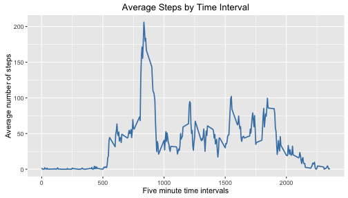
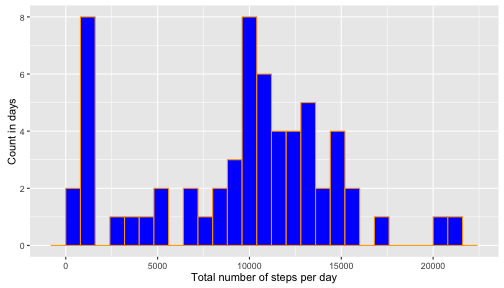

================================================================================

### Reproducible Research  
#### R Code for Course Project 1  

*This assignment makes use of data from a personal activity monitoring device.
This device collects data at 5 minute intervals throughout the day. The data
consists of two months of data from an anonymous individual collected during the
months of October and November, 2012 and include the number of steps taken in 5
minute intervals each day.*

*The variables included in this dataset are:  
- steps: Number of steps taking in a 5-minute interval (missing values are coded
as NA)  
- date: The date on which the measurement was taken in YYYY-MM-DD format  
- interval: Identifier for the 5-minute interval in which measurement was taken  
The dataset is stored in a comma-separated-value (CSV) file and there are a 
total of 17,568 observations in this dataset.*

This assignment will be described in multiple parts. 
The entire assignment is written in a single R markdown document that can be
processed by knitr and be transformed into an HTML file.  
Throughout the report, the code that is used to generate the output presented is
included using ```echo = TRUE``` so that someone else will be able to read the
code.


#### 1. Prepare Dataset

1.1 Clear workspace

```r
### Clear the workspace
        rm(list=ls())
```

1.2 Set working directory (change to your own directory)

```r
#        setwd("~005. Reproducible Research/Course Project 1/")
```

1.3 Downloading and saving the data

```r
### Download data
#### Note: Always use method = “curl” when downloading a file on a mac
        fileURL <- "https://d396qusza40orc.cloudfront.net/repdata%2Fdata%2Factivity.zip"
        if(!file.exists("activity.zip")){
                print("Downloading activity.zip")
                download.file(fileURL, destfile="activity.zip", method="curl")
        } else {print("activity.zip is present in folder")}
```

```
## [1] "activity.zip is present in folder"
```

```r
        ## Unzip the data
        if(file.exists("activity.csv")){
                print("activity.csv already exists")
        } else{
                unzip("activity.zip", exdir="./")
        }
```

```
## [1] "activity.csv already exists"
```


1.4 Read in data and transform the date variable into a valid date class to allow
for easier processing: "date" is in YYYY-MM-DD format

```r
        require(dplyr)
```

```
## Loading required package: dplyr
## 
## Attaching package: 'dplyr'
## 
## The following object is masked from 'package:nlme':
## 
##     collapse
## 
## The following objects are masked from 'package:stats':
## 
##     filter, lag
## 
## The following objects are masked from 'package:base':
## 
##     intersect, setdiff, setequal, union
```

```r
        activity <- read.csv("activity.csv", header = TRUE,na.strings = "NA") %>%
                mutate(date = as.Date(date, "%Y-%m-%d"))
```


General information activity dataset

```r
### Head
        head_act <- head(activity)
        head_act
```

```
##   steps       date interval
## 1    NA 2012-10-01        0
## 2    NA 2012-10-01        5
## 3    NA 2012-10-01       10
## 4    NA 2012-10-01       15
## 5    NA 2012-10-01       20
## 6    NA 2012-10-01       25
```

```r
### Summary
        summary_act <- summary(activity)
        summary_act
```

```
##      steps             date               interval     
##  Min.   :  0.00   Min.   :2012-10-01   Min.   :   0.0  
##  1st Qu.:  0.00   1st Qu.:2012-10-16   1st Qu.: 588.8  
##  Median :  0.00   Median :2012-10-31   Median :1177.5  
##  Mean   : 37.38   Mean   :2012-10-31   Mean   :1177.5  
##  3rd Qu.: 12.00   3rd Qu.:2012-11-15   3rd Qu.:1766.2  
##  Max.   :806.00   Max.   :2012-11-30   Max.   :2355.0  
##  NA's   :2304
```


#### 2. What is the mean total number of steps taken per day?
For this part of the assignment, you can ignore the missing values in the
dataset.

2.1. Calculate the total number of steps taken per day

```r
## Create a new dataframe with the total number of steps per day
        hist_act = with(activity, aggregate(steps, by = list(date), sum))
        names(hist_act) = c("date", "steps")
## Look at the first few rows of data
        head(hist_act)
```

```
##         date steps
## 1 2012-10-01    NA
## 2 2012-10-02   126
## 3 2012-10-03 11352
## 4 2012-10-04 12116
## 5 2012-10-05 13294
## 6 2012-10-06 15420
```

2.2 If you do not understand the difference between a histogram and a barplot, research the difference between them. 

*"Histograms are used to show distributions of variables while bar charts are used to compare variables. Histograms plot quantitative data with ranges of the data grouped into bins or intervals while bar charts plot categorical data."*
- Quote taken from [Forbes](https://www.google.co.uk/url?sa=t&rct=j&q=&esrc=s&source=web&cd=3&cad=rja&uact=8&ved=0ahUKEwjel-Sos-vJAhWKchQKHZ52BTQQFggnMAI&url=http%3A%2F%2Fwww.forbes.com%2Fsites%2Fnaomirobbins%2F2012%2F01%2F04%2Fa-histogram-is-not-a-bar-chart%2F&usg=AFQjCNFxMJk7VfSxNnpaLbksZgIHdtPV2w)

2.3 Make a histogram of the total number of steps taken each day using ggplot2

```r
        require(ggplot2)
        dailysteps <- ggplot(hist_act, aes(x = steps)) + 
                geom_histogram(binwidth = 800, color="blue", fill="orange") +
                labs(x = "Total number of steps per day", y = "Count")
        dailysteps
```

 

2.4 Calculate and report the mean and median of the total number of steps taken per day

```r
        mean_steps <- mean(hist_act$steps, na.rm = TRUE)
        median_steps <- median(hist_act$steps, na.rm = TRUE)
## The mean of total number of steps:
        mean_steps
```

```
## [1] 10766.19
```

```r
## The median of total number of steps:
        median_steps
```

```
## [1] 10765
```


#### 3. What is the average daily activity pattern?

3.1 Make a time series plot (i.e. type = "l") of the 5-minute interval (x-axis) 
and the average number of steps taken, averaged across all days (y-axis)

```r
## Create a table of the mean of the average steps taken per interval
        timeseries = with(activity, aggregate(steps, by = list(interval), mean, 
                na.rm = T))
## Rename the columns
        names(timeseries) = c("interval", "mean_steps")
## Look at the first few rows of data
head(timeseries)
```

```
##   interval mean_steps
## 1        0  1.7169811
## 2        5  0.3396226
## 3       10  0.1320755
## 4       15  0.1509434
## 5       20  0.0754717
## 6       25  2.0943396
```

Use ggplot2 to build and format the line graph

```r
        require(ggplot2)
        timeplot = ggplot(timeseries, aes(x = interval, y = mean_steps)) + 
                geom_line(color = "steelblue", size = 1.1) +
                ggtitle('Average Steps by Time Interval') +
                labs(x = "Five minute time intervals", y = "Average number of steps")
        timeplot
```

 

3.2 Which 5-minute interval, on average across all the days in the dataset,
contains the maximum number of steps?

```r
        timeseries$interval[which.max(timeseries$mean_steps)]
```

```
## [1] 835
```


#### 4. Imputing missing values

Note that there are a number of days/intervals where there are missing values
(coded as NA). The presence of missing days may introduce bias into some
calculations or summaries of the data.

4.1 Calculate and report the total number of missing values in the dataset (i.e.
the total number of rows with NAs)

```r
        sum_na <- sum(is.na(activity$steps))
## The total number of rows with NAs in the activity dataset is
        sum_na
```

```
## [1] 2304
```


4.2 Devise a strategy for filling in all of the missing values in the dataset. 
The strategy does not need to be sophisticated. For example, you could use the
mean/median for that day, or the mean for that 5-minute interval, etc.

```r
## Create a new dataframe with the median number of steps per interval
        medianact = with(activity, aggregate(steps, by = list(interval),
                median, na.rm = T))
## Rename the variables columns of medianact
        names(medianact) = c("interval", "steps")
## Look at the first few rows of data
        head(medianact)
```

```
##   interval steps
## 1        0     0
## 2        5     0
## 3       10     0
## 4       15     0
## 5       20     0
## 6       25     0
```

4.3 Create a new dataset that is equal to the original dataset but with the
missing data filled in.

```r
## Rename the original activity dataframe to activity_complete. This dataframe 
## will be used to replace the NAs with within interval median values        
        activity_complete = activity
## Now for every 
for (i in 1:nrow(activity_complete)) {
      if (is.na(activity_complete$steps[i]) == T) {
            activity_complete$steps[i] = medianact$steps[activity_complete$interval[i] == medianact$interval]
      } else {          
      }
}
## If NAs were replaced, sum should now be zero
sum(is.na(activity_complete$steps))
```

```
## [1] 0
```

4.4 Make a histogram of the total number of steps taken each day and calculate 
and report the mean and median total number of steps taken per day. Do these
values differ from the estimates from the first part of the assignment? What is
the impact of imputing missing data on the estimates of the total daily number 
of steps?

```r
## As done in Question 2, create a new dataframe with the total number of steps
## per day from the new complete dataset without missing values
        hist_comp = with(activity_complete, aggregate(steps, by = list(date),
                sum))
        names(hist_comp) = c("date", "steps")
```

```r
## Create the new histogram and call is dailycomp
        require(ggplot2)
        dailycomp <- ggplot(hist_comp, aes(x = steps)) + 
                geom_histogram(binwidth = 800, color="orange", fill="blue") +
                labs(x = "Total number of steps per day", y = "Count")
        dailycomp
```

 

```r
## Recalculate and report the mean and median of the total number of steps taken per day with the replaced na values and compare them to the original values.
        mean_comp <- mean(hist_comp$steps, na.rm = TRUE)
        median_comp <- median(hist_comp$steps, na.rm = TRUE)
## The old mean compared to the complete mean of total number of steps:
        mean_steps
```

```
## [1] 10766.19
```

```r
        mean_comp
```

```
## [1] 9503.869
```

```r
## The old median compared to the complete median of total number of steps:
        median_steps
```

```
## [1] 10765
```

```r
        median_comp
```

```
## [1] 10395
```
Both the median and mean number of steps after replacing the NAs are lower than
the original mean and median.


#### 5. Are there differences in activity patterns between weekdays and weekends?
For this part the weekdays() function may be of some help here. Use the dataset
with the filled-in missing values for this part.

5.1 Create a new factor variable in the dataset with two levels – “weekday” and
“weekend” indicating whether a given date is a weekday or weekend day.

```r
        activity_complete$date = as.Date(activity_complete$date, "%Y-%m-%d")
        dateweekdays = weekdays(activity_complete$date)
        dateweekend =  dateweekdays == "Saturday" | dateweekdays == "Sunday"
        activity_complete$day = factor(as.integer(dateweekend),
                levels=c(0, 1),
                labels=c("weekday", "weekend"))
## Look at the first few rows of data with added variable
head(activity_complete)
```

```
##   steps       date interval     day
## 1     0 2012-10-01        0 weekday
## 2     0 2012-10-01        5 weekday
## 3     0 2012-10-01       10 weekday
## 4     0 2012-10-01       15 weekday
## 5     0 2012-10-01       20 weekday
## 6     0 2012-10-01       25 weekday
```


5.2 Make a panel plot containing a time series plot (i.e. type = "l") of the
5-minute interval (x-axis) and the average number of steps taken, averaged 
across all weekday days or weekend days (y-axis).

```r
## Create a new dataframe weekdata, which contains mean number of steps per
## interval for week days and weekend days (double nr rows of timeseries)
        weekdata = aggregate(steps ~ interval + day, FUN="mean", data =
                activity_complete)

## Create figure using the lattice package         
        require('lattice')
        xyplot(steps ~ interval | day, data = weekdata,
         xlab = 'Interval', ylab = 'Mean number of steps',
         type = 'l', layout=c(1, 2))
```

 
